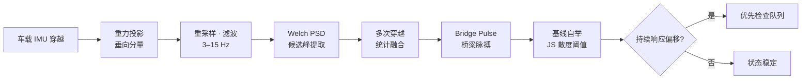

<p align="center">
  
</p>

<h1 align="center">黔脉 · QianPulse</h1>

<p align="center">
  不新增一个传感器，把桥梁的观测密度从「按年」提到「按天」
</p>

<p align="center">
  <a href="https://qianpulse.caixuntong.cn"><strong>在线演示</strong></a> ·
  <a href="#-快速开始">本地运行</a> ·
  <a href="#-证据分层">证据分层</a> ·
  <a href="#-技术边界">技术边界</a>
</p>

<p align="center">
  
  
  
  
</p>

---

## 为什么做这件事

贵州已建和在建桥梁超过 **32,000 座**，世界前一百座高桥近一半在这里。桥，是这片九成山地土地上持续发展的基础设施底座——但**通车那天，只是每座桥五十年故事的开始**。

面对漫长的服役期，现实的养护手段只有两条路：

| 手段 | 成本 | 盲区 |
|---|---|---|
| 人工检查 | 封道、登高、组织队伍，按「**年**」计 | 两次检查之间的变化无人知晓 |
| 结构监测系统 | 按「**千万**」计 | 只能覆盖极少数重点桥 |

三万座桥，被留在了两次检查之间。**问题从不挑检查日出现。**

## 核心洞察

> 桥上每天最不缺的，是**车**。而每一辆驶过桥面的车，都载着惯性测量单元（IMU）——每一次通过，都是一次对桥梁的「测量」。
>
> 只是这些测量从未被记录，过完桥，就随风而去。

**黔脉做的事，就是把这张被浪费的观测网留下来：**

- **单车很吵**：单次穿越的加速度被车辆悬架、发动机、路面不平度污染，频谱上找不到桥；
- **多车成脉**：千百次穿越统计融合后，属于桥的响应自然显现——噪声互相抵消，桥梁主频浮出水面；
- **偏移可见**：当前脉搏与历史基线的持续偏移，用 Jensen–Shannon 散度量化，直接回答「有限的检查资源，先投向哪座桥」。

## 工作原理



完整的 11 级流水线：传感器摄取 → 重力投影 → 重采样 → 滤波 → Welch PSD → 候选提取 → 多穿越融合 → Bridge Pulse → 基线自举 → JS 散度 → 持续响应筛查。

关键设计决策（全部可trace到代码与测试）：

- **频段锁定 3–15 Hz**：桥跨一阶竖弯频率的典型区间，域外能量直接滤除；
- **KDE 绝对带宽 0.15 Hz**：避免自适应带宽把噪声模糊成假峰；
- **候选峰等权投票**：而非按 prominence 加权，防止单次强噪声主导融合；
- **阈值来自基线内部 bootstrap 的 95 分位**：不引入任何人工标定数字。

在 1,000 条穿越轨迹的融合演示中：单车频谱混沌 → 融合主频稳定收敛于 **7.81 Hz**，噪声残差降至 **0%**。工作原理页提供里程碑滑杆（1 → 3 → 10 → 30 → 100 → 300 → 1000），全过程可交互复现。

## 系统导览

打开应用首先进入**六步电影式叙事**（万桥贵州 → 从建设到长期服役 → 真正的缺口 → 换一个角度 → 核心洞察 → 黔脉 Reveal），随后进入指挥中心：

| 页面 | 内容 |
|---|---|
| **总览** | 128 座桥梁的感知网络地图（11 偏移 / 21 观察 / 96 稳定），矢量底图、状态筛选、呼吸光晕、悬停档案、三幕自动巡览，回答「优先检查哪座」 |
| **桥梁详情** | 以 GZ-017 为例的响应偏移证据链：状态、原因、下一步 |
| **工作原理** | 融合流量滑杆：从单车混沌到千车成脉的收敛全程，附候选峰投票散点与噪声坍缩曲线 |
| **真实实验** | 真实 iPhone + 缩尺结构的受控验证（基线 vs 加配重扰动） |
| **车载试点** | 车载穿越数据的解析管线：垂向波形、候选峰、KDE 融合，主频 7.81 Hz |
| **系统架构** | 边缘 → 特征包 → 按 bridge_id 分区 → 增量统计 → SQLite 的流式架构，及本地规模模拟（1,000 车 / 10,000 次穿越）实测指标 |
| **来源与证据** | 官方来源、真实数据与模拟数据的清晰区分 |

## 证据分层

本项目**严格区分**演示数据与真实证据，所有页面均有明确标注，绝不混淆：

| 层级 | 性质 | 说明 |
|---|---|---|
| 网络总览 / 融合演示 | `SIMULATED` | 固定随机种子，完全离线可复现，用于现场演示 |
| 缩尺结构实验 | `REAL · iPhone` | 真实手机 + 缩尺结构，基线 vs 密封水瓶加配重的受控扰动 |
| 车载试点 | `已脱敏 · 车载数据` | 车载穿越数据已脱敏处理，管线验证通过（融合主频 7.81 Hz） |
| 规模模拟 | `LOCAL SCALE SIMULATION` | asyncio 本地队列架构验证，非生产部署声明 |

## 快速开始

```bash
# 1. 克隆
git clone https://github.com/Zhiyunyang274/qianpulse.git
cd qianpulse

# 2. 一键运行（自动创建 venv 并安装依赖）
./run_demo.sh

# 或手动：
python3 -m venv .venv
source .venv/bin/activate
pip install -r requirements.txt
streamlit run app.py
```

打开 `http://localhost:8501` 即可。演示默认 `SIMULATED` 模式，固定种子，不依赖任何外部服务。

### 不启动界面，只跑引擎

```bash
python scripts/run_simulation.py               # 多穿越融合数值验证
python scripts/validate_physical_experiment.py  # 真实缩尺实验数据分析
python scripts/run_scale_simulation.py --vehicles 1000 --crossings 10000  # 规模模拟
```

### Python API

```python
from qianpulse.ingestion import load_sensorlogger_export
from qianpulse.fusion import fuse_crossings
from qianpulse.screening import bootstrap_baseline_divergence, screen_response

crossings = load_sensorlogger_export("crossings.zip")
baseline = fuse_crossings(crossings[:30])
current = fuse_crossings(crossings[30:])
threshold = bootstrap_baseline_divergence(crossings[:30])["threshold95"]
decision = screen_response(baseline["fingerprint"], current["fingerprint"], threshold)
print(decision["status"], decision["recommendation"])
```

### 导入真实 iPhone Sensor Logger 数据

应用内切换到 `REAL · Sensor Logger`，上传 Sensor Logger 导出的 CSV / ZIP。解析器自动识别 accelerometer CSV、timestamp 字段与 x/y/z 轴，估计采样率并输出统一穿越结构。缩尺实验数据按状态放置即可被自动发现：

```text
data/physical_validation/
├── baseline/*.zip
└── perturbed/*.zip
```

## 部署

生产部署采用 **Nginx 反代 + systemd 常驻**，地图库自托管内联，底图瓦片经同源代理缓存，大陆网络环境可用：

```bash
SERVER=root@<服务器IP> DOMAIN=<域名> CERTBOT_EMAIL=<邮箱> ./deploy/deploy_aliyun.sh
```

详细配置见 [deploy/](deploy/)（Nginx 站点配置、systemd 服务、一键部署脚本）。设计要点：

- **零 CDN 依赖**：MapLibre GL JS 下载至 `assets/vendor/` 内联进地图 iframe，境外 CDN 不可达不影响加载；
- **瓦片同源代理**：Nginx 代理 OpenFreeMap 瓦片并缓存 30 天，浏览器只需访问本站；
- **优雅降级**：底图彻底不可用时回退到离线 SVG 示意图，应用功能不受影响。

## 测试

```bash
python -m pytest -q
# 17 passed
```

覆盖：信号预处理、PSD 与候选峰提取、融合收敛、JS 散度筛查、Sensor Logger 解析、车载数据解析、特征包契约、规模模拟。

## 项目结构

```text
qianpulse_starter/
├── app.py                      # 入口：六步叙事 + 感知网络总览
├── pages/                      # 桥梁详情 / 工作原理 / 真实证据 / 车载试点 / 架构 / 来源
├── qianpulse/                  # 引擎（无 UI 依赖）
│   ├── engine.py               # 核心算法：预处理 · PSD · 融合 · 筛查
│   ├── pipeline.py             # FeaturePacket · BridgePulseState 增量统计
│   ├── io_sensorlogger.py      # Sensor Logger 解析
│   ├── io_driveby.py           # 车载穿越数据解析
│   ├── physical_validation.py  # 缩尺实验分析
│   ├── scale_simulation.py     # 本地规模模拟
│   └── simulate.py             # 可复现模拟数据生成
├── data/                       # 缩尺实验 / 车载试点数据（已脱敏）
├── assets/                     # 叙事素材 · 自托管地图库
├── deploy/                     # Nginx · systemd · 一键部署
├── scripts/                    # 数值验证脚本
├── tests/                      # 17 个单元测试
└── docs/architecture.md        # 系统架构设计文档
```

## 技术边界

**黔脉检测的是桥梁动态响应相对于自身历史基线的持续变化，它不诊断结构损伤，不替代专业桥梁检测。** 系统输出仅为「建议优先工程检查」，不输出裂缝、失效或安全风险判断——筛查的意义，是让有限的检查资源先投向真正偏移的那座桥。

缩尺实验的扰动方式为密封满水瓶加配重，验证的是响应偏移的可检测性，而非结构损伤识别。

## 许可

[MIT](LICENSE)

## 致谢

- 桥梁数据与背景：[贵州省交通运输厅](https://jt.guizhou.gov.cn/)、贵州高速集团公开资料
- 底图：[OpenFreeMap](https://openfreemap.org/)（免费无 Key 矢量瓦片）· [MapLibre GL JS](https://maplibre.org/)
- 传感器数据采集：Sensor Logger（iOS）
