<p align="center">
  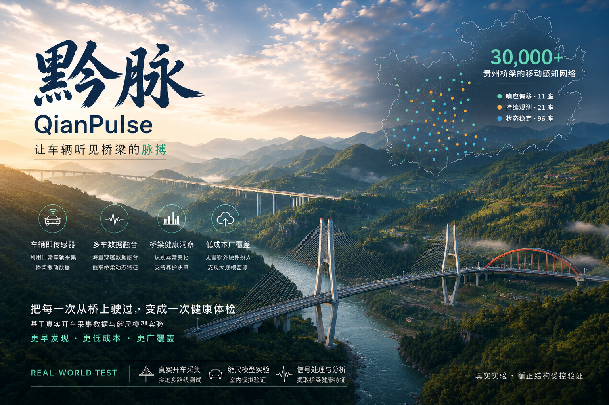
</p>

<h1 align="center">黔脉 · QianPulse</h1>

<p align="center">
  不新增一个传感器，把桥梁的观测密度从「按年」提到「按天」
</p>

<p align="center">
  <a href="https://qianpulse.caixuntong.cn"><strong>在线演示</strong></a> ·
  <a href="#-快速开始">本地运行</a> ·
  <a href="#-证据分层">证据分层</a> ·
  <a href="#-技术边界">技术边界</a>
</p>

<p align="center">
  <sub>首次打开在线演示加载时间较长（尤其是地图，矢量瓦片经服务器代理缓存，首次加载后显著提速）——请耐心等待</sub>
</p>

<p align="center">
  
</p>

<p align="center">
  
  
  
  
</p>

---

## 为什么做这件事

贵州已建和在建桥梁超过 **32,000 座**，世界前一百座高桥近一半在这里。桥，是这片九成山地土地上持续发展的基础设施底座——但**通车那天，只是每座桥五十年故事的开始**。

面对漫长的服役期，现实的养护手段只有两条路：

| 手段 | 成本 | 盲区 |
|---|---|---|
| 人工检查 | 封道、登高、组织队伍，按「**年**」计 | 两次检查之间的变化无人知晓 |
| 结构监测系统 | 按「**千万**」计 | 只能覆盖极少数重点桥 |

三万座桥，被留在了两次检查之间。**问题从不挑检查日出现。**

## 核心洞察

> 桥上每天最不缺的，是**车**。而每一辆驶过桥面的车，都载着惯性测量单元（IMU）——每一次通过，都是一次对桥梁的「测量」。
>
> 只是这些测量从未被记录，过完桥，就随风而去。

**黔脉做的事，就是把这张被浪费的观测网留下来：**

- **单车很吵**：单次穿越的加速度被车辆悬架、发动机、路面不平度污染，频谱上找不到桥；
- **多车成脉**：千百次穿越统计融合后，属于桥的响应自然显现——噪声互相抵消，桥梁主频浮出水面；
- **偏移可见**：当前脉搏与历史基线的持续偏移，用 Jensen–Shannon 散度量化，直接回答「有限的检查资源，先投向哪座桥」。

## 界面一览

<p align="center">
  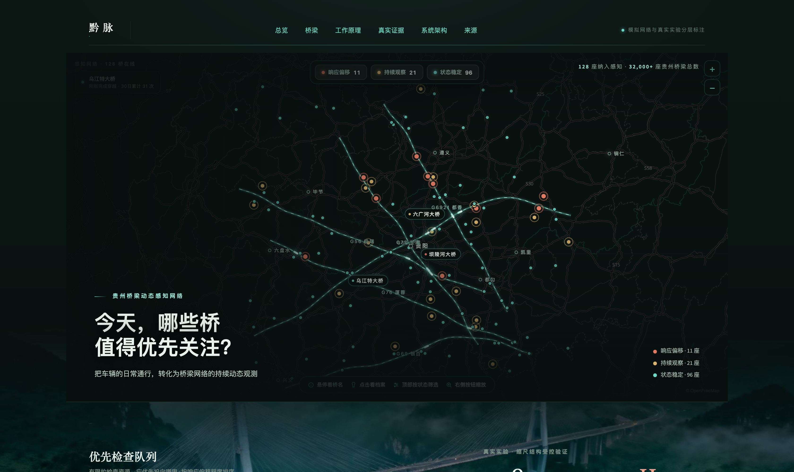
</p>
<p align="center"><sub><b>总览 · 感知网络地图</b> —— 128 座桥梁在线：11 座响应偏移（红）/ 21 座持续观察（金）/ 96 座状态稳定（青），路网光脉与车流动画实时呈现</sub></p>

| | |
|:---:|:---:|
| 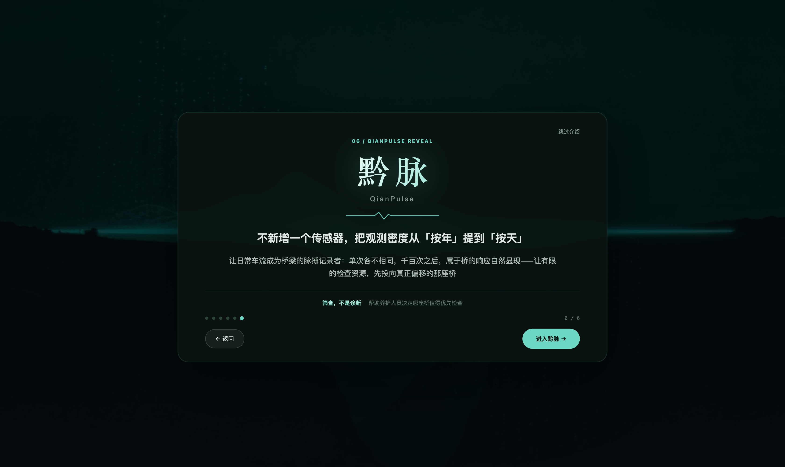<br><sub><b>六步电影式叙事</b> · 从万桥贵州到黔脉 Reveal</sub> | 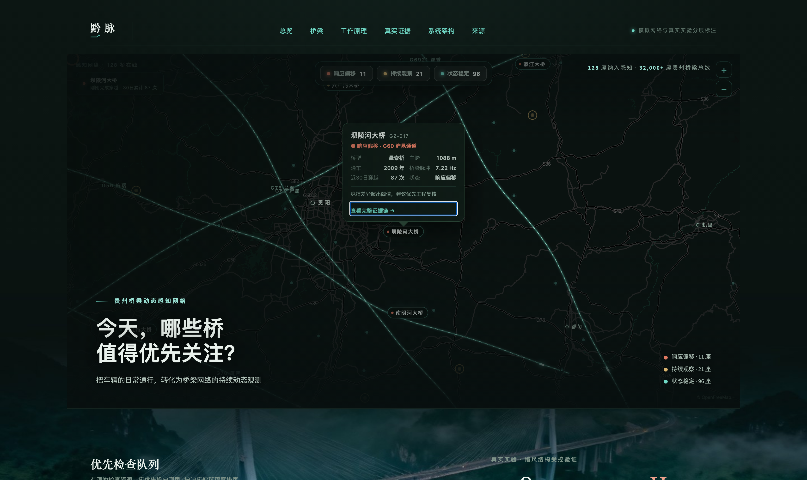<br><sub><b>地图交互</b> · 点击桥梁查看档案，其余桥自动暗化为背景</sub> |
| 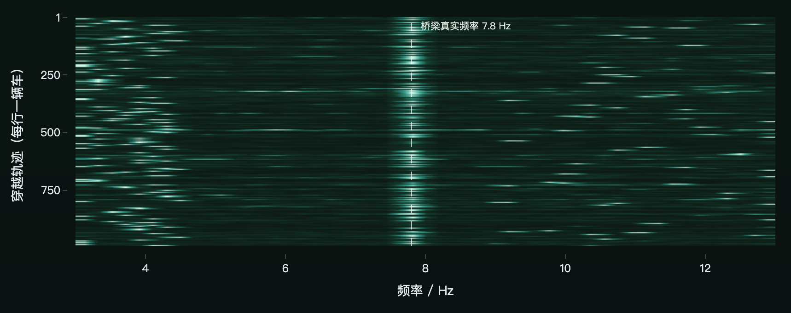<br><sub><b>千次穿越热图</b> · 单车频谱混沌，7.8 Hz 桥梁分量随轨迹堆积成带</sub> | 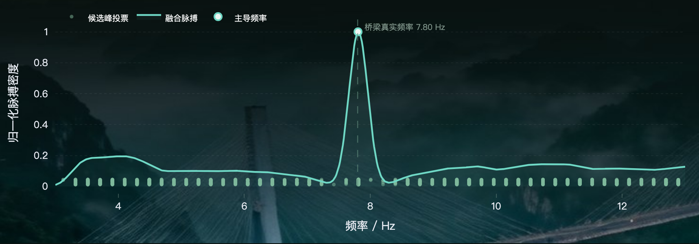<br><sub><b>融合脉搏</b> · 候选峰等权投票后，桥梁主频压倒性浮现</sub> |
| 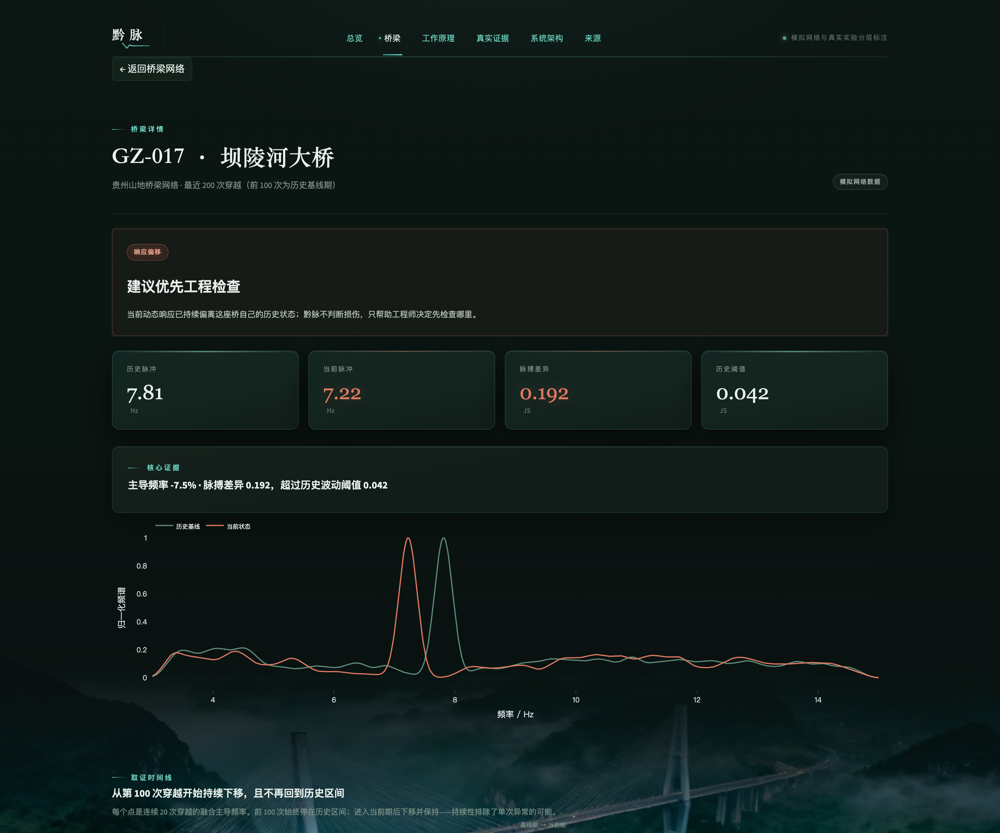<br><sub><b>桥梁详情</b> · 偏移证据链：状态 → 原因 → 下一步</sub> | 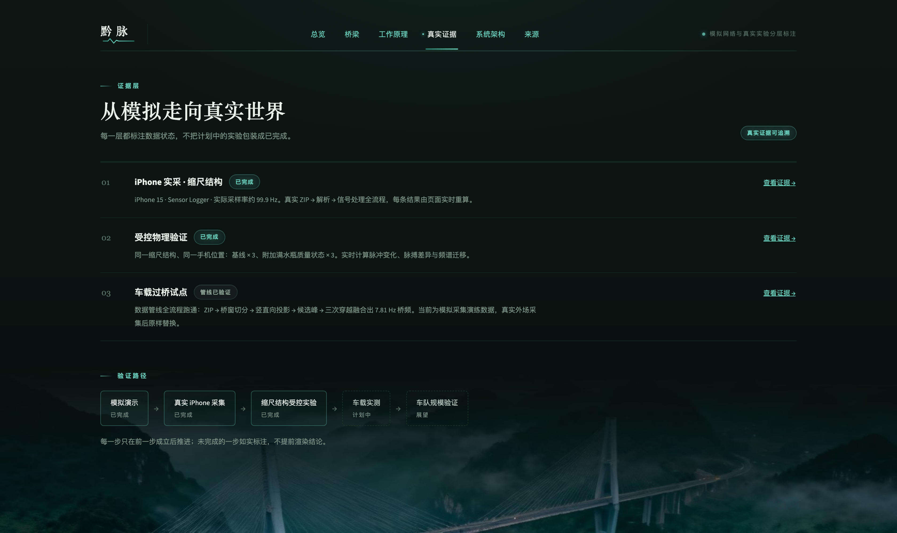<br><sub><b>真实证据</b> · 模拟 / 真实 / 车载数据显式分层标注</sub> |

## 问题形式化

桥梁竖向加速度响应的提取，在单车视角下是一个**病态反问题**（ill-posed inverse problem）：车载 IMU 记录的是「结构响应 × 传递路径 × 车辆动力学」三重卷积的混叠——悬架（~1.7 Hz）、车身（~2.7 Hz）、发动机（~19.6 Hz）谐波与路面宽带激励全部叠加上桥跨模态（3–15 Hz）之上，且传递路径随每次过桥的车道、车速、车辆参数而变。单次穿越的频谱不存在一致的逆解。

黔脉的解法不是增强单次观测，而是**更换统计框架**：桥是每次观测中唯一的不变量。车辆噪声的候选频率随驾驶条件游走、彼此独立，而桥梁模态频率在每次观测中重复出现——于是把「参数估计」转化为「密度估计」问题，用大数定律让不变量浮现。

### 学术基础

这条路径的物理可行性并非设想——**Nature Portfolio 旗下《Communications Engineering》已在真实桥梁上完成实验验证**（Matarazzo et al., 2022）：

| 实验 | 规模 | 结果 |
|---|---|---|
| 金门大桥 · 受控穿越 | 102 次 iPhone 5/6 车内采集 | 恢复前二至三阶模态频率，部分估计误差 <0.5% |
| 金门大桥 · Uber 真实运营 | 72 次穿越，37 种不同车型 | 非实验车队——真实司机的日常运营数据 |
| 意大利短跨公路桥（28 m） | 280 组智能手机数据 | 约 100 组即达 <6% 模态频率误差 |

该文献的核心结论与黔脉的融合逻辑同源：单次 trip 证据不足，但 crowdsourced 数据聚合可以让桥梁模态从车辆、路面与噪声中浮现。同一路线的后续研究（[Communications Engineering, 2024](https://www.nature.com/articles/s44172-024-00243-y)）仍在持续发展。

因此黔脉的准确定位是：**文献证明了 smartphone vehicle trips 能恢复真实桥梁的动态特征；黔脉把这个已被验证的原理，转化为面向贵州三万余座桥的省级筛查系统**——用公交、出租、物流与巡检车形成持续感知网络，把模态识别论文变成养护优先级。

## 方法

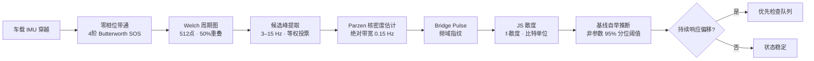

**信号条件化** · 一阶多项式去趋势消除传感器漂移与路面长波；4 阶 Butterworth 带通以 SOS（二阶节）级联实现、`filtfilt` 零相位双向滤波，保证群延迟恒为零——相位失真会移动谱峰位置，这对频率估计是不可容忍的。

**谱估计** · Welch 分段周期图平均（512 点窗、50% 重叠），在方差与频率分辨率之间取标准折衷——分段平均将周期图方差降低约窗数分之一，代价是分辨率，对 3–15 Hz 的模态区间绰绰有余。

**候选峰投票** · 每次穿越在带内提取 top-k 候选峰，**等权**进入全局投票。这是刻意的稳健统计选择：若按 prominence 加权，一次强车噪主导的穿越即可劫持融合结果；等权投票赋予每个候选同等的先验，让桥梁分量靠「重复出现」而非「单次强度」胜出——本质上是均值对中位数的 breakdown-point 论证在频域的对应物。

**密度融合** · 候选峰集合经 Parzen 核密度估计（固定**绝对带宽 0.15 Hz**，而非 Scott 自适应规则）聚合为 Bridge Pulse——桥梁的频域指纹。固定绝对带宽是关键：自适应带宽在候选稀疏时自动展宽，会把随机噪声模糊成伪结构；0.15 Hz 对应 800 点估计网格上足以分辨相邻模态、又窄到不抹平真实峰形的尺度。

**偏移度量** · 基线指纹与当前指纹的比较使用 Jensen–Shannon 散度（base-2，比特）。选 JS 而非 KL 散度有三重理由：JS 对称（偏移无方向先验）、有界（[0,1]，跨桥可比）、其平方根满足三角不等式——是 f-散度家族中唯一诱导真度量的成员，赋予偏移量「距离」的物理解释。

<p align="center">
  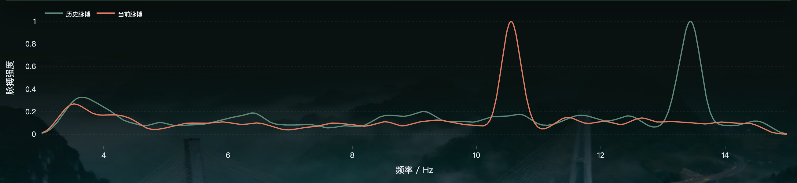
</p>
<p align="center"><sub>历史基线（绿）与当前脉搏（红）的指纹偏移 —— JS 散度 0.192，远超自举阈值 0.042</sub></p>

**阈值推断** · 告警阈值不靠人工标定，而由**基线内部自举**（bootstrap）非参数推断：对基线穿越做 40 次无放回 55% 二次抽样，计算成对指纹散度分布，取 95% 分位。含义是——只有当当前脉搏偏离基线的程度超过「基线自身随机波动」的合理范围时才告警，把假阳性率控制在一个由数据决定的水平上，不引入任何主观常数。

**收敛保证** · 融合稳定性按 $s_n = c_n \cdot (1 - 1/\sqrt{n})$ 构造，其中 $c_n$ 为落在主导频率 ±0.25 Hz 内的候选比例——显式编码了中心极限定理的 $O(1/\sqrt{n})$ 收敛速率：穿越次数翻四倍，估计噪声减半。工作原理页的千次轨迹演示（里程碑滑杆 1 → 3 → 10 → 30 → 100 → 300 → 1000）实测复现了该速率：融合主频收敛于 **7.81 Hz**，次峰噪声残差衰减至 **0%**。

<p align="center">
  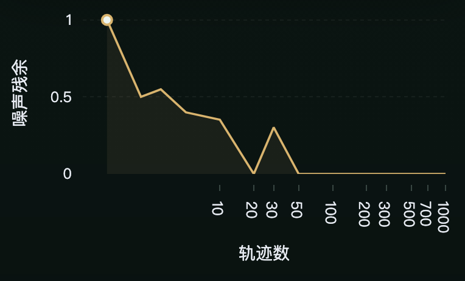
</p>
<p align="center"><sub>噪声残差随轨迹数 N 的坍缩轨迹 —— 与 O(1/√N) 收敛速率一致</sub></p>

### 关键设计决策一览

| 决策 | 理由 |
|---|---|
| 频段锁定 3–15 Hz | 桥跨一阶竖弯模态的典型区间；域外能量全部滤除，压缩假设空间 |
| KDE 绝对带宽 0.15 Hz | 自适应带宽在稀疏候选上会制造伪结构；绝对带宽保证跨数据可比性 |
| 候选峰等权投票 | 稳健统计：防单次强噪声劫持融合结果，breakdown point 最大化 |
| JS 而非 KL 散度 | 对称、有界、满足度量公理——偏移量具有「距离」语义 |
| 自举 95% 分位阈值 | 非参数推断，阈值由数据内生决定，零人工标定 |
| 稳定性 $\propto 1-1/\sqrt{n}$ | 显式 CLT 收敛速率，可被滑杆演示直接验证 |

## 系统导览

打开应用首先进入**六步电影式叙事**（万桥贵州 → 从建设到长期服役 → 真正的缺口 → 换一个角度 → 核心洞察 → 黔脉 Reveal），随后进入指挥中心。整套界面遵循「叙事 → 证据 → 行动」的审查动线设计：

| 页面 | 内容 |
|---|---|
| **总览** | 128 座桥梁的感知网络地图（11 偏移 / 21 观察 / 96 稳定），矢量底图、状态筛选、呼吸光晕、悬停档案、三幕自动巡览——把筛查结果压缩为「资源该投向哪」的一个视觉回答 |
| **桥梁详情** | 以 GZ-017 为例的响应偏移证据链：状态 → 原因 → 下一步，完整决策路径 |
| **工作原理** | 融合流量滑杆：从单车混沌到千车成脉的收敛全程，候选峰投票散点、KDE 融合曲线、噪声坍缩轨迹三视图联动 |
| **真实实验** | 真实 iPhone + 缩尺结构的受控验证：基线 vs 密封水瓶加配重扰动，重力投影、采样抖动、逐次主峰、JS 散度全部实时计算 |
| **车载试点** | **10 次真实开车穿越**（同一座平桥，正向 6 次 / 反向 4 次，iPhone 15 · 100 Hz）：重力投影垂向波形、候选峰投票、融合主频稳定收敛于 ≈11.9 Hz；另附模拟演练数据作管线对照 |
| **系统架构** | 边缘特征提取 → `FeaturePacket` 契约 → 按 `bridge_id` 分区 → 增量统计 → SQLite 持久化的流式架构；附本地规模模拟（1,000 车 / 10,000 次穿越）实测吞吐 |
| **来源与证据** | 官方来源、真实数据与模拟数据的显式分层标注 |

## 证据分层

本项目**严格区分**演示数据与真实证据——每一层都显式标注，页面渲染逻辑与数据 manifest 双重强制，杜绝混同：

| 层级 | 性质 | 说明 |
|---|---|---|
| 网络总览 / 融合演示 | `SIMULATED` | 固定随机种子，完全离线可复现，用于现场演示 |
| 缩尺结构实验 | `REAL · iPhone` | 真实手机 + 缩尺结构，基线 vs 密封水瓶加配重的受控扰动 |
| 车载试点 | `REAL FIELD DATA` | 同一座平桥 10 次真实开车穿越（无标注 → 全程窗口模式），融合主频 ≈11.9 Hz；另含 3 条模拟演练数据作管线对照，显式标注不混淆 |
| 规模模拟 | `LOCAL SCALE SIMULATION` | asyncio 本地队列架构验证，非生产部署声明 |

## 快速开始

```bash
# 1. 克隆
git clone https://github.com/Zhiyunyang274/qianpulse.git
cd qianpulse

# 2. 一键运行（自动创建 venv 并安装依赖）
./run_demo.sh

# 或手动：
python3 -m venv .venv
source .venv/bin/activate
pip install -r requirements.txt
streamlit run app.py
```

打开 `http://localhost:8501` 即可。演示默认 `SIMULATED` 模式，固定种子，不依赖任何外部服务。

### 不启动界面，只跑引擎

```bash
python scripts/run_simulation.py               # 多穿越融合数值验证
python scripts/validate_physical_experiment.py  # 真实缩尺实验数据分析
python scripts/run_scale_simulation.py --vehicles 1000 --crossings 10000  # 规模模拟
```

### Python API

```python
from qianpulse.ingestion import load_sensorlogger_export
from qianpulse.fusion import fuse_crossings
from qianpulse.screening import bootstrap_baseline_divergence, screen_response

crossings = load_sensorlogger_export("crossings.zip")
baseline = fuse_crossings(crossings[:30])
current = fuse_crossings(crossings[30:])
threshold = bootstrap_baseline_divergence(crossings[:30])["threshold95"]
decision = screen_response(baseline["fingerprint"], current["fingerprint"], threshold)
print(decision["status"], decision["recommendation"])
```

### 导入真实 iPhone Sensor Logger 数据

应用内切换到 `REAL · Sensor Logger`，上传 Sensor Logger 导出的 CSV / ZIP。解析器自动识别 accelerometer CSV、timestamp 字段与 x/y/z 轴，估计采样率并输出统一穿越结构。缩尺实验数据按状态放置即可被自动发现：

```text
data/physical_validation/
├── baseline/*.zip
└── perturbed/*.zip
```

## 部署

生产部署采用 **Nginx 反代 + systemd 常驻**，地图库自托管内联，底图瓦片经同源代理缓存，大陆网络环境可用：

```bash
SERVER=root@<服务器IP> DOMAIN=<域名> CERTBOT_EMAIL=<邮箱> ./deploy/deploy_aliyun.sh
```

详细配置见 [deploy/](deploy/)（Nginx 站点配置、systemd 服务、一键部署脚本）。设计要点：

- **零 CDN 依赖**：MapLibre GL JS 下载至 `assets/vendor/` 内联进地图 iframe，境外 CDN 不可达不影响加载；
- **瓦片同源代理**：Nginx 代理 OpenFreeMap 瓦片并缓存 30 天，浏览器只需访问本站；
- **优雅降级**：底图彻底不可用时回退到离线 SVG 示意图，应用功能不受影响。

## 测试

```bash
python -m pytest -q
# 17 passed
```

覆盖：信号预处理、PSD 与候选峰提取、融合收敛、JS 散度筛查、Sensor Logger 解析、车载数据解析、特征包契约、规模模拟。

## 项目结构

```text
qianpulse_starter/
├── app.py                      # 入口：六步叙事 + 感知网络总览
├── pages/                      # 桥梁详情 / 工作原理 / 真实证据 / 车载试点 / 架构 / 来源
├── qianpulse/                  # 引擎（无 UI 依赖）
│   ├── engine.py               # 核心算法：预处理 · PSD · 融合 · 筛查
│   ├── pipeline.py             # FeaturePacket · BridgePulseState 增量统计
│   ├── io_sensorlogger.py      # Sensor Logger 解析
│   ├── io_driveby.py           # 车载穿越数据解析
│   ├── physical_validation.py  # 缩尺实验分析
│   ├── scale_simulation.py     # 本地规模模拟
│   └── simulate.py             # 可复现模拟数据生成
├── data/                       # 缩尺实验 / 车载试点数据（已脱敏）
├── assets/                     # 叙事素材 · 自托管地图库
├── deploy/                     # Nginx · systemd · 一键部署
├── scripts/                    # 数值验证脚本
├── tests/                      # 17 个单元测试
└── docs/architecture.md        # 系统架构设计文档
```

## 技术边界

**黔脉检测的是桥梁动态响应相对于自身历史基线的持续统计偏移，而非结构损伤本身。** 桥梁响应偏移的可能成因谱系很宽——支座约束状态改变、温度效应、铺装层刚度演化、下部结构沉降，以及真正的结构性退化——频域指纹无法在因果层面区分它们。因此系统的输出边界被严格限定为「建议优先工程检查」，不输出裂缝、失效或安全风险判断。这不是能力妥协，而是工程严谨性：**筛查的价值在于改变资源分配的先验，而非替代专业检测的后验。**

缩尺实验的扰动方式为密封满水瓶加配重（改变系统质量分布与动特性），验证的是响应偏移的可检测性与管线的端到端正确性，而非结构损伤识别能力。

## 许可

**AGPL-3.0 + 双许可**。本项目以 [GNU AGPL-3.0](LICENSE) 发布：您可以自由学习、修改与自部署，但任何基于本项目的网络服务必须同样开源其完整修改；若需闭源商用（产品集成、私有化交付等），需另行获取商业授权，请联系作者洽谈。

> 版权人不受 AGPL 约束，保留一切商业授权与闭源分发权利。

## 致谢

- 桥梁数据与背景：[贵州省交通运输厅](https://jt.guizhou.gov.cn/)、贵州高速集团公开资料
- 底图：[OpenFreeMap](https://openfreemap.org/)（免费无 Key 矢量瓦片）· [MapLibre GL JS](https://maplibre.org/)
- 传感器数据采集：Sensor Logger（iOS）
